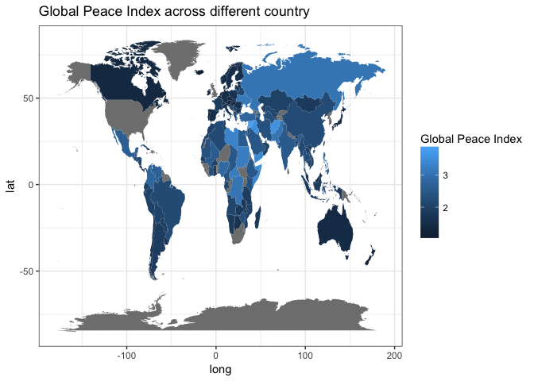
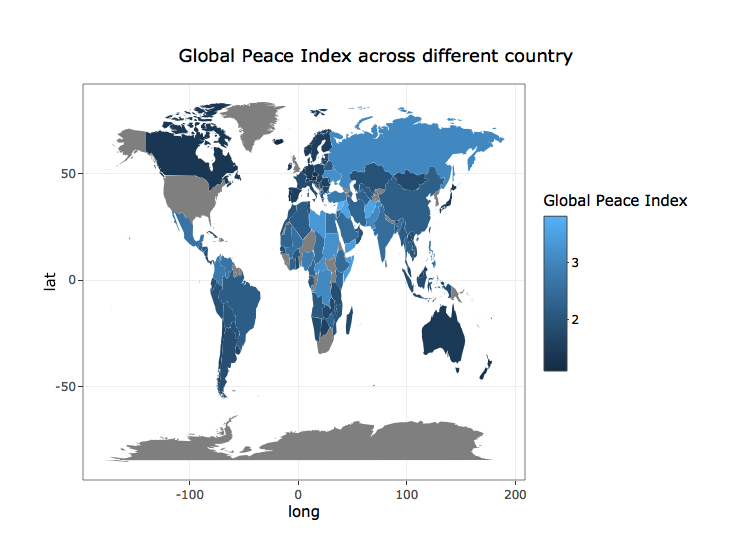

Global Peace Index 2017
================

### Global Peace Index

``` r
a = ggplot() + 
  geom_polygon(data = map.world.joined, aes(x = long, y = lat, group = group, fill = map.world.joined$`2017_score`)) +
  labs(title = 'Global Peace Index across different country', fill = 'Global Peace Index') +
  theme(axis.text= element_blank(),
        axis.title= element_blank(),
        axis.ticks= element_blank()) +
  theme_bw()

a
```



``` r
ggplotly(a)
```


